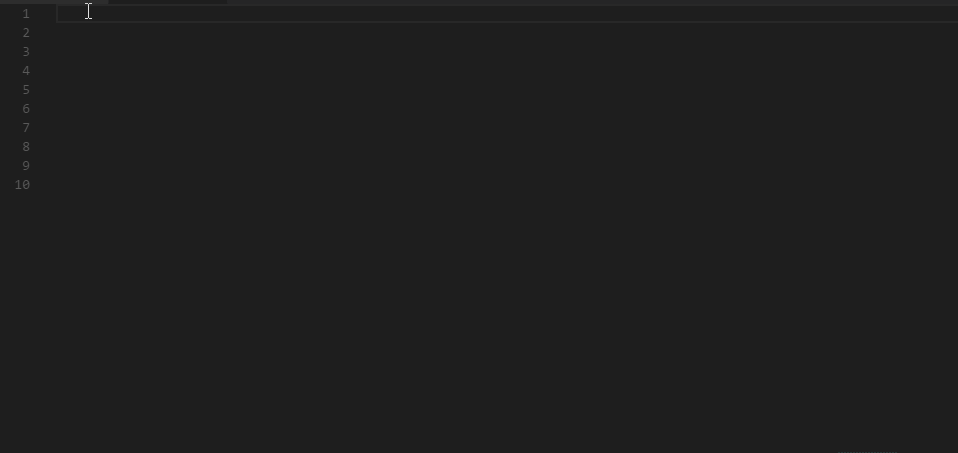

# Increment Selection

Increment, decrement or reverse selection with multiple cursors for VSCode  

## Usage

### Available Commands
* Increment Selection
* Decrement Selection
* Reverse Selection

### Configurations 
* topToBottom: option to always process increments from top to bottom selection.

### Default Keymap

Win\Linux:  
<kbd>ctrl</kbd> + <kbd>alt</kbd> + <kbd>I</kbd>  
<kbd>ctrl</kbd> + <kbd>shift</kbd> + <kbd>P</kbd> => Increment Selection  

Mac:  
<kbd>cmd</kbd> + <kbd>alt</kbd> + <kbd>I</kbd>  
<kbd>cmd</kbd> + <kbd>shift</kbd> + <kbd>P</kbd> => Increment Selection  

## Contributors
* [Alberto Morato](https://albymor.github.io/)
* [Tom Sherman](https://tom-sherman.github.io/)
* [Greatness7](https://github.com/Greatness7)

## LICENSE
[LICENSE](./LICENSE)
